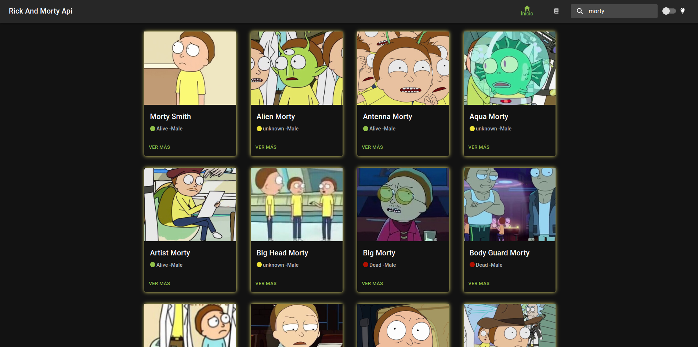
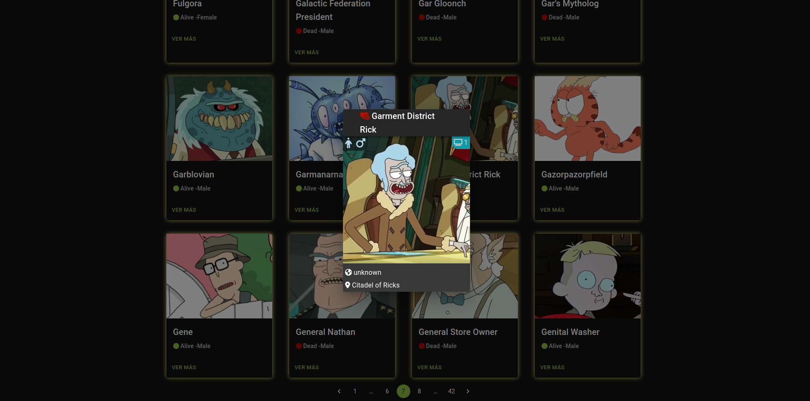
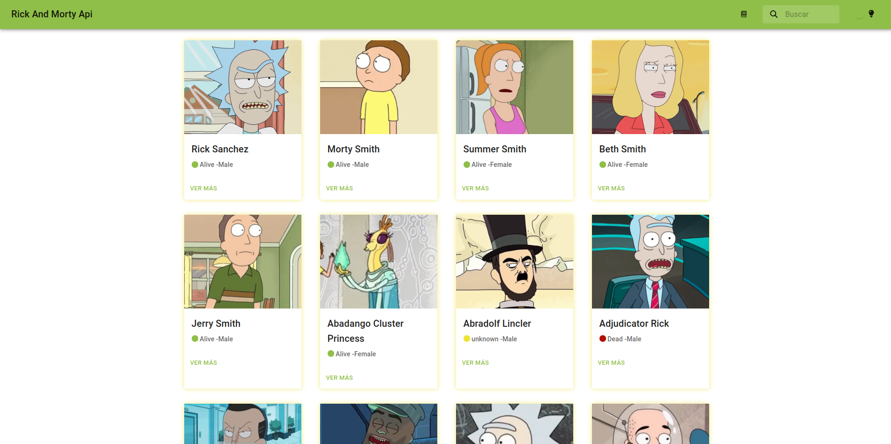

# Rick and Morty API

Aplicación que consume una API con información de la serie animada **Rick and Morty** creada con **Vite**.

## Principales Tecnologías

-  React Js
-  Redux
-  Redux Tool Kit
-  Typescript

## Usar en desarrollo

Después de clonar el repositorio de **git**

```bash
npm i
npm run dev
```

Ya que solo consume una API no se crearon variables de entorno.

## Redux

El **store** que se declara en el **Provider** de _App_ se encuentra en la raíz de la carpeta **redux**. AL utilizar **Redux Tool Kit** se creo el **store** con **configureStore** que dentro de un objeto se declaran los **reducers**

```javascript
const store = configureStore({
	reducer: {
		settings: persistReducer<
			ReturnType<typeof settingsReducer>
		>(persistSettingsConfing, settingsReducer),
		personajes: personajesReducer,
	},
	middleware: defaultMiddleware =>
		defaultMiddleware({ serializableCheck: false }),
});
```

En el mismo archifvo _store.ts_ se declaran los **types** que nos ayudan a que Typescript reconozca el tipado en el **dispatch** y en el **selector**

```javascript
export type RootState = ReturnType<typeof store.getState>;
export type Dispatch = typeof store.dispatch;
export type Thunk = ThunkAction<
	ReturnType<any>,
	RootState,
	unknown,
	Action<any>,
>;
```

En la carpeta de _slices_ dentro de _redux_ se crean los diferentes _slice_ que se utilizaron, los _slice_ nos van a ayudar a generar automaticamente los **action types** y los **action creators** mediante un objeto de funciones que recibe. Dentro encontramos el nombre, el estado inicial y las funciones que afectaran a los estados desde el **payload**.

```javascript
const settingsSlice = createSlice({
	name: 'settings',
	initialState,
	reducers: {
		setThemeMode: (
			state,
			action: PayloadAction<string>,
		) => {
			state.themeMode = action.payload;
		},
	},
});

export const { setThemeMode } = settingsSlice.actions;

export default settingsSlice.reducer;
```

Como se logra ver en **reducers** se agrega una función que modifica el estado que controla el tema de la aplicación. Para utilizar esa función en nuestros componentes se exporta.

### Customización de Hooks

Los **Hooks customizados** se crearon para reemplazar el **useSelector** y **useDispatch**. ¿Esto a qué nos ayuda? a conocer el tipado y tener un mejor control en **Typescript**.

```javascript
export const useCustomDispatch: () => Dispatch =
	useDispatch;
export const useCustomSelector: TypedUseSelectorHook<RootState> =
	useSelector;
```

Como se puede ver usamos el **Dispatch** y el **RootState** de los tipos declarados en el **store**.

### Persist Reducer

Nos ayuda a modificar el **Local Storage**. Se cra un objeto de configuración y se agrega en el reducer que queremos que se este guardando información.

```javascript
const persistSettingsConfing = {
	key: 'settings',
	storage,
	withList: ['theme'],
};
//dentro
reducer: {
		settings: persistReducer<
			ReturnType<typeof settingsReducer>
		>(persistSettingsConfing, settingsReducer),
		personajes: personajesReducer,
	},
```

## Screen




